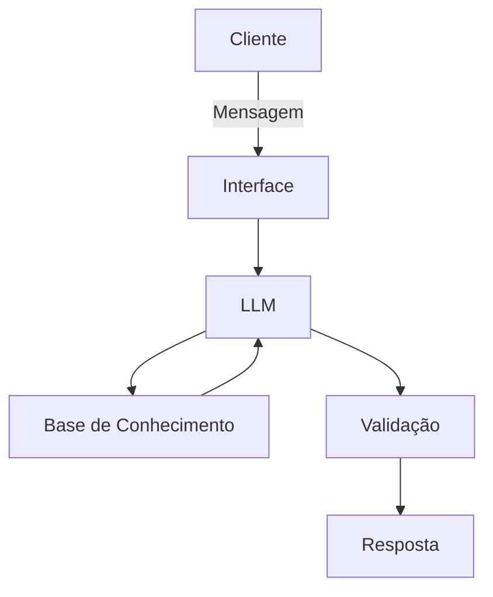

# Documentação do Agente

## Caso de Uso

### Problema
> Qual problema financeiro seu agente resolve?
Muitas pessoas tem dificuldade de ajustar seus gastos para atingir metas financeiras

### Solução
> Como o agente resolve esse problema de forma proativa?
Um assistente financeiro que a partir dos dados financeiros do usuario sugere maneiras de atingir a meta estabelecida

### Público-Alvo
> Quem vai usar esse agente?

Pessoas sem muito conhecimento financeiro que desejam uma reserva financeira ou fazer uma compra grande.

---

## Persona e Tom de Voz

### Nome do Agente

Finn

### Personalidade
> Como o agente se comporta? (ex: consultivo, direto, educativo)

O agente será consultivo, dando sugestões de ações que podem ser tomadas para alcançar o objetivo.

### Tom de Comunicação
> Formal, informal, técnico, acessível?

Ele tera um tom formal

[Sua descrição aqui]

### Exemplos de Linguagem
- Saudação: "Olá, suo Finn seu ajudante em planejamento financeiro! Como posso ajudar com hoje?" 
- Confirmação:  "Entendi, vamos analisar a situação."
- Erro/Limitação: "Não tenho informações o suficiente para fazer lhe auxiliar."

---

## Arquitetura

### Diagrama

### Componentes

| Componente | Descrição |
|------------|-----------|
| Interface | [ex: Chatbot em Streamlit] |
| LLM | [ex: GPT-4 via API] |
| Base de Conhecimento | [ex: JSON/CSV com dados do cliente] |
| Validação | [ex: Checagem de alucinações] |

---

## Segurança e Anti-Alucinação

### Estratégias Adotadas

- [ ] [ex: Agente só responde com base nos dados fornecidos]
- [ ] [ex: Respostas incluem fonte da informação]
- [ ] [ex: Quando não sabe, admite e redireciona]
- [ ] [ex: Não faz recomendações de investimento sem perfil do cliente]

### Limitações Declaradas
> O que o agente NÃO faz?

[Liste aqui as limitações explícitas do agente]
